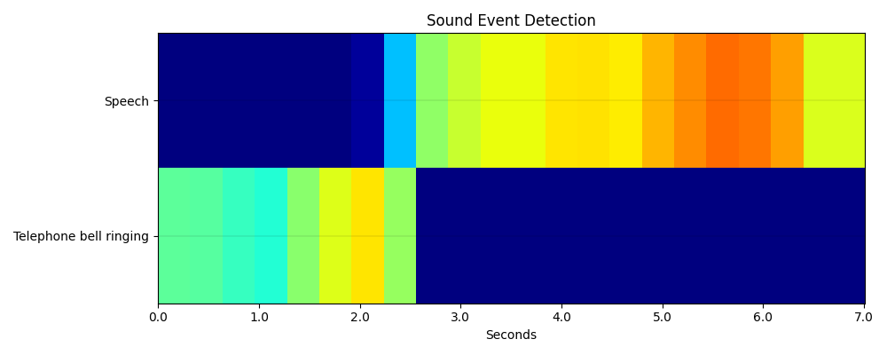

# <div align="center">Audio Tagging & Sound Event Detection in PyTorch</div>

Progress:

- [ ] Mixup Augmentation
- [ ] Random Noise Augmentation
- [ ] Spec Augmentation
- [ ] SED fine tuning


## <div align="center">Model Zoo</div>

[cnn14]: https://drive.google.com/file/d/1GhDXnyj9KgDMyOOoMuSBn8pb1iELlEp7/view?usp=sharing
[cnn1416k]: https://drive.google.com/file/d/1BGAfVH_6xt06YZUDPqRLNtyj7KoyoEaF/view?usp=sharing
[cnn14max]: https://drive.google.com/file/d/1K0XKf6JbFIgCoo70WvdunQoWWMMmrqDl/view?usp=sharing

<details open>
  <summary><strong>AudioSet Pretrained Models</strong></summary>

Model | Task | mAP <br><sup>(%) | Sample Rate <br><sup>(kHz) | Window Length | Num Mels | Fmax | Weights
--- | --- | --- | --- | --- | --- | --- | --- 
CNN14 | Tagging | 43.1 | 32 | 1024 | 64 | 14k | [download][cnn14]
CNN14_16k | Tagging | 43.8 | 16 | 512 | 64 | 8k | [download][cnn1416k]
||
CNN14_DecisionLevelMax | SED | 38.5 | 32 | 1024 | 64 | 14k | [download][cnn14max]

</details>

> Note: These are the pretrained models from [audioset-tagging-cnn](https://github.com/qiuqiangkong/audioset_tagging_cnn). Check out this official repo if you want to train on audioset. Training on audioset will not be supported in this repo due to resource constraints. 

[esc50cnn14]: https://drive.google.com/file/d/1oYFws7hvGtothbnzf1vDtK4dQ5sjbgR2/view?usp=sharing

<details open>
  <summary><strong>Fine-tuned Models</strong></summary>

Model | Task | Dataset | Accuracy<br><sup>(%)  | Sample Rate <br><sup>(kHz) | Window Length | Num Mels | Fmax | Weights
--- | --- | --- | --- | --- | --- | --- | --- | --- 
CNN14 | Tagging | ESC50<br>(Fold-5) | 94.75<br>(no aug) | 32 | 1024 | 64 | 14k | [download][esc50cnn14]
CNN14 | Tagging | FSDKaggle2018<br>(val) | ? | 32 | 1024 | 64 | 14k | -
CNN14 | Tagging | UrbandSound8k<br>(Fold-10) | ? | 32 | 1024 | 64 | 14k | -
CNN14 | Tagging | SpeechCommandsv1<br>(val/test) | ? | 32 | 1024 | 64 | 14k | -

</details>

---

## <div align="center">Supported Datasets</div>

[esc50]: https://github.com/karolpiczak/ESC-50
[fsdkaggle]: https://zenodo.org/record/2552860
[audioset]: https://research.google.com/audioset/
[urbansound8k]: https://urbansounddataset.weebly.com/urbansound8k.html
[speechcommandsv1]: https://ai.googleblog.com/2017/08/launching-speech-commands-dataset.html
[speechcommandsv2]: http://download.tensorflow.org/data/speech_commands_v0.02.tar.gz

Dataset | Type | Classes | Train | Val | Test | Audio Length | Audio Spec | Size
--- | --- | --- | --- | --- | --- | --- | --- | --- 
[ESC-50][esc50] | Environmental | 50 | 2,000 | 5 folds | - | 5s | 44.1kHz, mono | 600MB
[UrbanSound8k][urbansound8k] | Urban | 10 | 8,732 | 10 folds | - | <=4s | Vary | 5.6GB
[FSDKaggle2018][fsdkaggle] | - | 41 | 9,473 | 1,600 | - | 300ms~30s | 44.1kHz, mono | 4.6GB
[SpeechCommandsv1][speechcommandsv1] | Words | 30 | 51,088 | 6,798 | 6,835 | <=1s | 16kHz, mono | 1.4GB
[SpeechCommandsv2][speechcommandsv2] | Words | 35 | 84,843 | 9,981 | 11,005 | <=1s | 16kHz, mono | 2.3GB


<details>
  <summary><strong>Dataset Structure</strong> (click to expand)</summary>

Download the dataset and prepare it into the following structure.

```
datasets
|__ ESC50
    |__ audio

|__ Urbansound8k
    |__ audio

|__ FSDKaggle2018
    |__ audio_train
    |__ audio_test
    |__ FSDKaggle2018.meta
        |__ train_post_competition.csv
        |__ test_post_competition_scoring_clips.csv

|__ SpeechCommandsv1/v2
    |__ bed
    |__ bird
    |__ ...
    |__ testing_list.txt
    |__ validation_list.txt

```

</details>

---

## <div align="center">Usage</div>

<details>
  <summary><strong>Configuration</strong> (click to expand)</summary>

Create a configuration file in `configs`. Sample configuration for ImageNet dataset can be found [here](configs/tagging.yaml). Then edit the fields you think if it is needed. This configuration file is needed for all of training, evaluation and prediction scripts.

</details>
<br>
<details>
  <summary><strong>Training</strong> (click to expand)</summary>

Train with 1 GPU:

```bash
$ python tools/train.py --cfg configs/CONFIG_FILE_NAME.yaml
```

Train with 2 GPUs:

```bash
$ python -m torch.distributed.launch --nproc_per_node=2 --use_env tools/train.py --cfg configs/CONFIG_FILE_NAME.yaml
```

</details>

<br>
<details>
  <summary><strong>Evaluation</strong> (click to expand)</summary>

Make sure to set `MODEL_PATH` of the configuration file to your trained model directory.

```bash
$ python tools/val.py --cfg configs/CONFIG_FILE_NAME.yaml
```

</details>

<br>
<details open>
  <summary><strong>Audio Tagging Inference</strong></summary>

* Set `MODEL_PATH` of the configuration file to your model's trained weights.
* Change the dataset name in `DATASET` >> `NAME` as your trained model's dataset.
* Set the testing audio file path in `TEST` >> `FILE`.
* Run the following command.

```bash
$ python tools/tagging_infer.py --cfg configs/TAGGING_CONFIG_FILE.yaml
```
You will get an output similar to this:

```bash
Class                     Confidence
----------------------  ------------
Speech                     0.893114
Telephone bell ringing     0.754014
Inside, small room         0.235118
Telephone                  0.182611
Music                      0.0922332
```

</details>

<br>
<details open>
  <summary><strong>Sound Event Detection Inference</strong></summary>

* Set `MODEL_PATH` of the configuration file to your model's trained weights.
* Change the dataset name in `DATASET` >> `NAME` as your trained model's dataset.
* Set the testing audio file path in `TEST` >> `FILE`.
* Run the following command.

```bash
$ python tools/sed_infer.py --cfg configs/SED_CONFIG_FILE.yaml
```
You will get an output similar to this:

```bash
Class                     Start    End
----------------------  -------  -----
Speech                      2.2    7
Telephone bell ringing      0      2.5
```

If you set `TEST` >> `PLOT` to `true`, the following plot will also show:



</details>

<br>
<details>
  <summary><strong>References</strong> (click to expand)</summary>

```
[1] Qiuqiang Kong, Yin Cao, Turab Iqbal, Yuxuan Wang, Wenwu Wang, and Mark D. Plumbley. "Panns: Large-scale pretrained audio neural networks for audio pattern recognition." IEEE/ACM Transactions on Audio, Speech, and Language Processing 28 (2020): 2880-2894
```

</details>